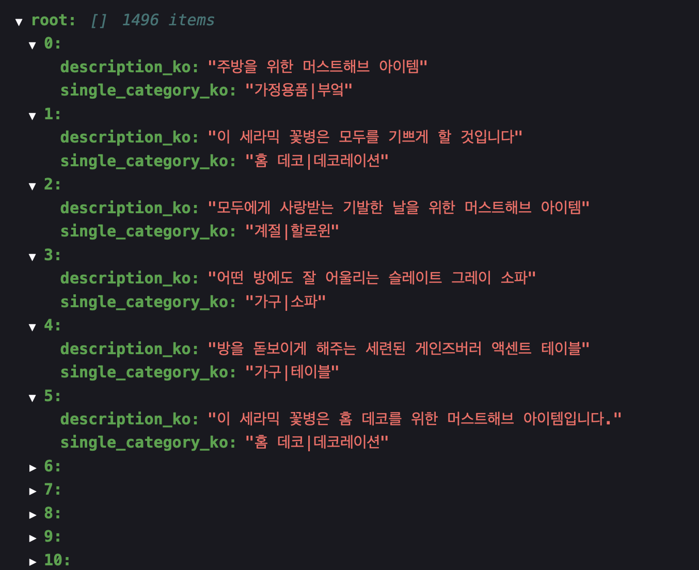
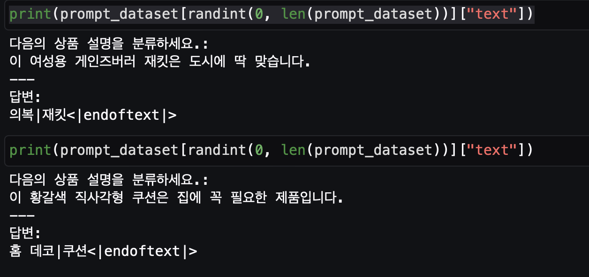

# Instruction-based Fine Tuning
이 폴더는 Instruction-based Fine Tuning 의 어려 예시 노트북 예시를 제공 합니다.

# 주요 노트북

- 1.sagemaker-kullm_PEFT.ipynb
    - 구름을 베이스 모델로 하여 Question & Answer 특화 작업을  KoAlpaca 데이터 세트로 LORA 파인 튜닝 예시 코드
- 2.sagemaker-kullm-PEFT-classification.ipynb
    - 구름을 베이스 모델로 하여 Classification 에 대한 특화 작업을 PEFT 파인 튜닝
        - Retail Demo Store 의 상품 설명, 상품 분류 데이터 셋으로 파인 튜닝
    - 데이터 셋: 아래와 같은 포맷으로 1496 개의 샘플 준비    
        - 
    - 훈련에 입력될 Text Data 생성
        - 위의 JSON 파일에서 Instruction, Product Description, Category 를 연결해서 text data 생성 후에 이를 인코딩 데이터 세트 (input_id, attention_mask) 생성하여 훈련 함.
            - 
        - 추론시에는 Text Data 와 같은 형태로 프로프트 만들어서 추론 함.
        
- 3.sagemaker-kullm-Inference-classification.ipynb
    - 위의 2번 노트북의 파인 튜닝된 모델과, 파인 튜닝 이전의 모델과 비교하면서 추론
    - 파인 튜닝 후에 실제 상품 분류를 잘 할 수 있는지를 확인
    - 
